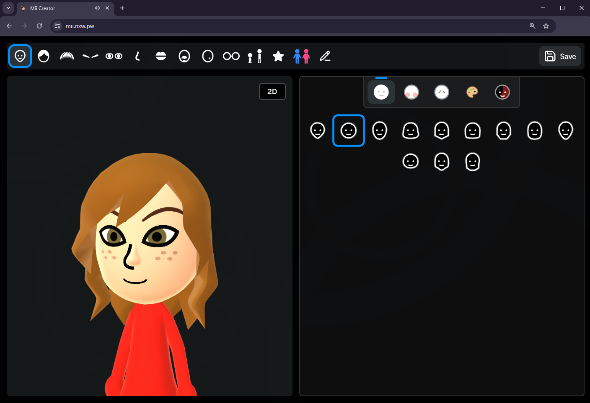

# Mii Creator App (Unofficial Public Instance)

Create and share Mii characters online with just a few clicks!

## Public vs. Official
This public instance is unofficial and is not affiliated with Kat21.

The official version ([mii.nxw.pw](https://mii.nxw.pw)) is more complete and has a lot more features and improvements, but it makes you sign in. It also doesn't use shaders for the icons in your Mii list. This public instance doesn't make you sign in, but it's based on an old version and doesn't have as many features and improvements. However, it does use better rendering for the icons in your Mii list.

Basically, the official version is the better one, but it has some room for improvement and it makes you sign in. If you want extra features, use the official version. If you don't want to sign in, use this public instance.

Sign this petition to bring back Guest Mode: https://www.change.org/Kat21GuestMode

## Credits

- Uses [ariankordi](https://github.com/ariankordi)'s awesome [FFL.js](https://github.com/ariankordi/FFL.js) library to generate 3D Mii heads and icons in real-time.
  - The code has been modified slightly from the original version so that it works for Mii Creator. See the [README](src/external/ffl.js/README.md).
- [mii-js](https://github.com/PretendoNetwork/mii-js) library used for interacting with Mii data in a JavaScript-friendly way
- [Some utility code](https://github.com/datkat21/mii-creator/tree/master/src/external/mii-frontend) "borrowed" from arian's website for conversion, QR codes, etc.
- Custom Mii Maker music by [objecty](https://x.com/objecty)
- GitHub Copilot and ChatGPT (sort of) helped me modify this to make it work with GitHub Pages.
- [ariankordi](https://github.com/ariankordi) did most of the FFL implementation for local rendering.

## Features

This app uses a custom, extended version of the FFSD Mii format that [Kat21](https://github.com/datkat21) (the original developer) calls the MiiCreator format (with the `.miic` file extension). It allows for extra colors and glasses from the Switch, while still allowing you to convert back to FFSD for 3DS/Wii U. It also allows for custom hats, clothing options, and face paint (but these are unofficial and aren't supported by any consoles).

- [x] Real 3D rendering (unlike Mii Studio)
- [x] Change parts and colours of your Mii
- [x] Save and load Miis in your library
- [x] Save a Mii to a QR code
- [x] Render to PNG image file
- [x] Export as 3D model (in GLB format)
- [x] Save and load Miis as `.miic` or `.ffsd` files
- [x] Create your own renders inside the app
- [x] Custom hats and clothing options

## Screenshots
[Click here](screenshots/Screenshots.md) to view screenshots.

## Contributing

I'm open to contributions if you want to help with the project!
I'm also fine with people forking and taking over the project and adding a whole bunch of features and improvements.

## Model Credits

Some of the custom hat models are provided by the Models Resource:

- [Top Hat](https://www.models-resource.com/nintendo_switch/supersmashbrosultimate/model/30314/)
- [Ribbon & Bow](https://www.models-resource.com/3ds/nintendogscats/model/30239/)

Thanks to [Timimimi](https://github.com/Timiimiimii) for creating the new hat models:

- Cat Ears
- Straw Hat
- Hijab
- Bike Helmet

## Setting Up Development

**NOTICE:** I haven't tested this process with this fork, so it might not work. Use the GitHub workflow to deploy to GitHub Pages.
After deployment, you might need to hard refresh the page (press Ctrl+Shift+R) for your changes to appear.

1. Make sure you have [Bun](https://bun.sh/) installed on your device. This is used for bundling all of the TypeScript code into JavaScript for the client.
2. Clone this repository, and run the `bun i` command to install dependencies.
3. In one terminal, run `bun build-ts` (if this doesn't work, try running `bun build.ts` to run the file), and in another, run `bun run serve`. If that doesn't work, try `bunx serve -l 3000 -C ./public`. (There is also an optional Go server if you want to use that over the bun server. Both seem to have a strange issue on Windows where you have to wait 5 seconds before you are allowed to refresh the page..)
4. Any changes you make should log in the build-ts terminal, and check the server on the second terminal to find the port. Live server is not advised when using my build script because it sometimes can refresh too much.
5. In this branch, you'll need to add a FFL resource file into the public folder (by default named `FFLResHigh.dat`.) You can find a compatible resource file [here](https://web.archive.org/web/20180502054513/http://download-cdn.miitomo.com/native/20180125111639/android/v2/asset_model_character_mii_AFLResHigh_2_3_dat.zip) (not hosted by me, but rename the file once extracted)

If you are making a pull request, please use a code editor that supports Prettier to keep the code style consistent.
