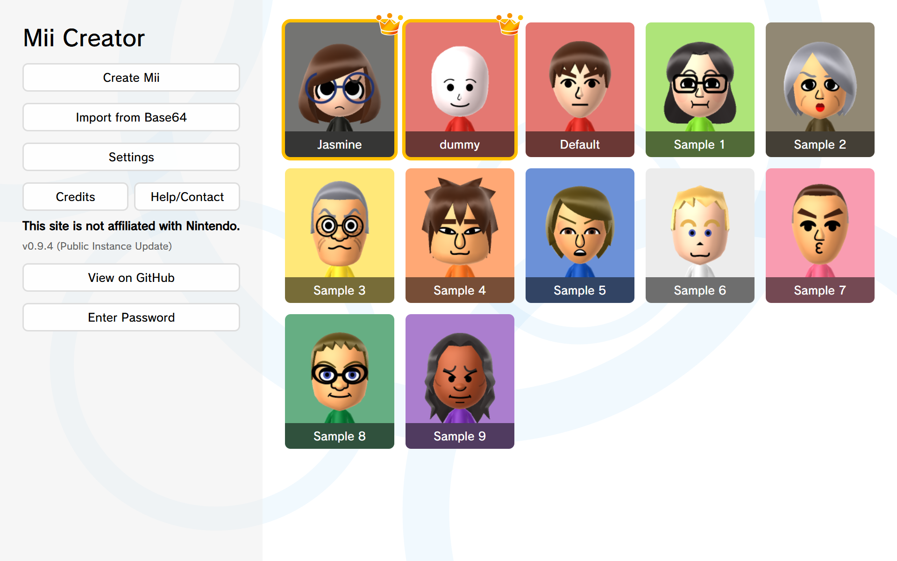
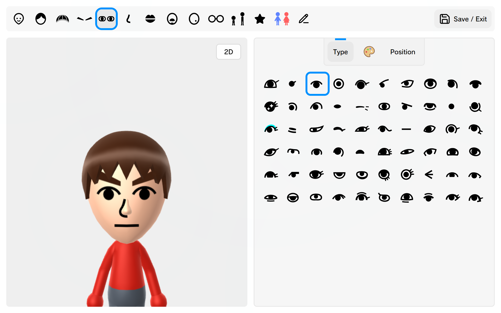
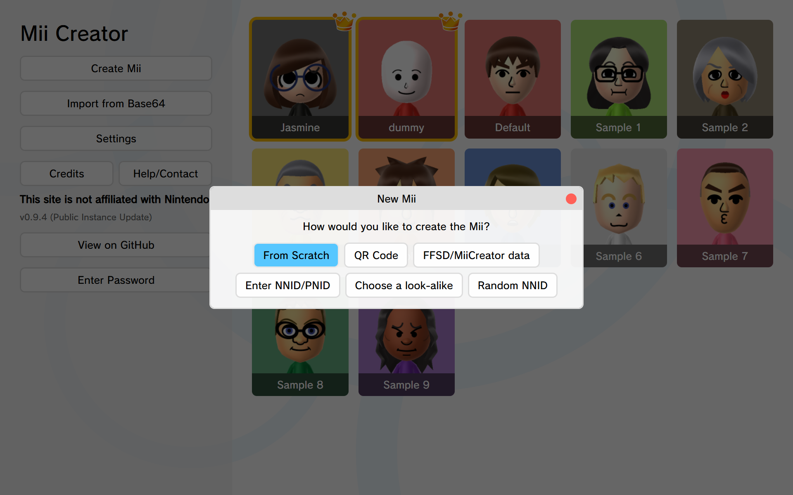
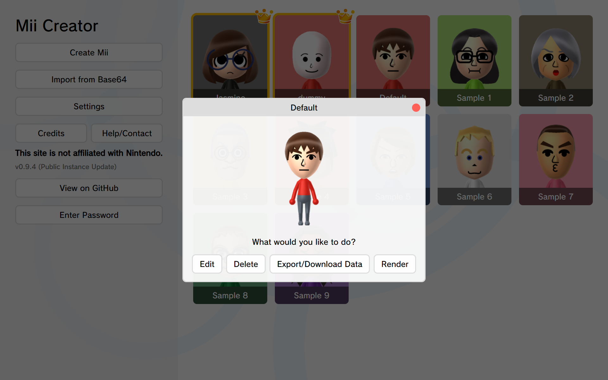
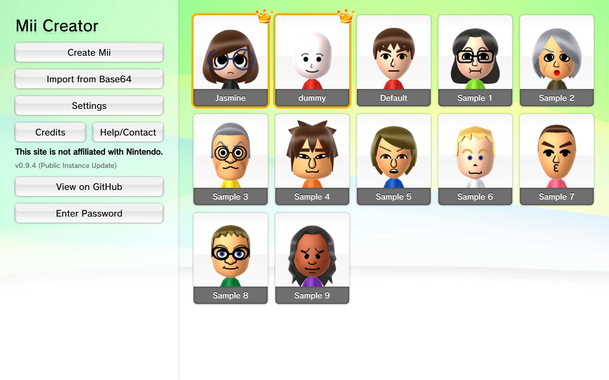
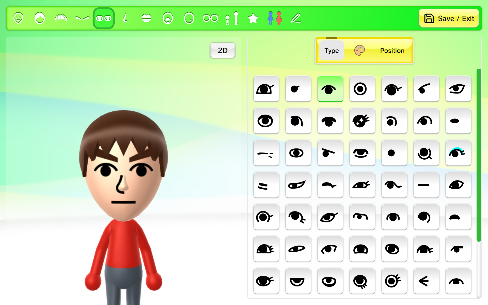
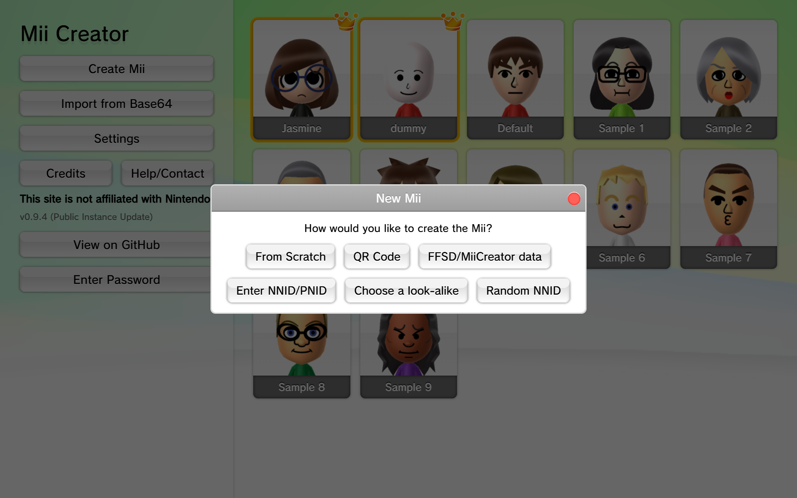
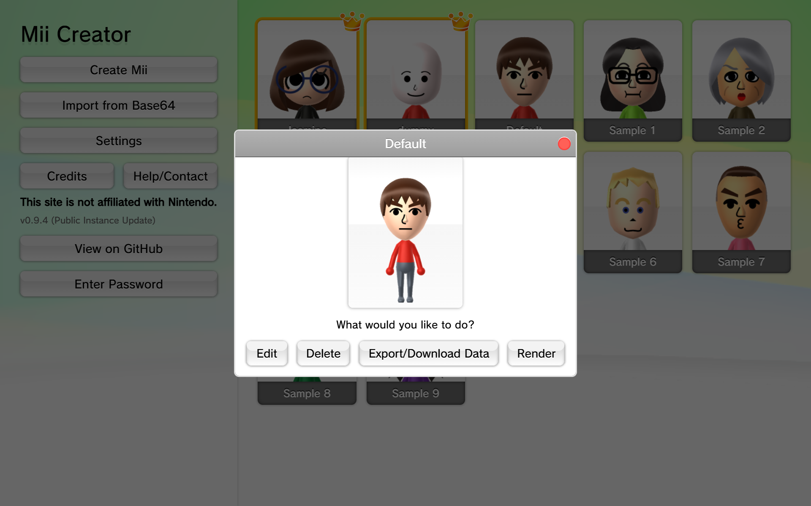

# Screenshots
There are 2 visual themes to choose from: Default and Wii U. The default theme will automatically use dark mode if it's enabled on your device.

## Default Theme
### Mii Library (Home Page)

### Mii Editor

### Create New Mii

### Mii Details

## Wii U Theme
### Mii Library (Home Page)

### Mii Editor

### Create New Mii

### Mii Details

